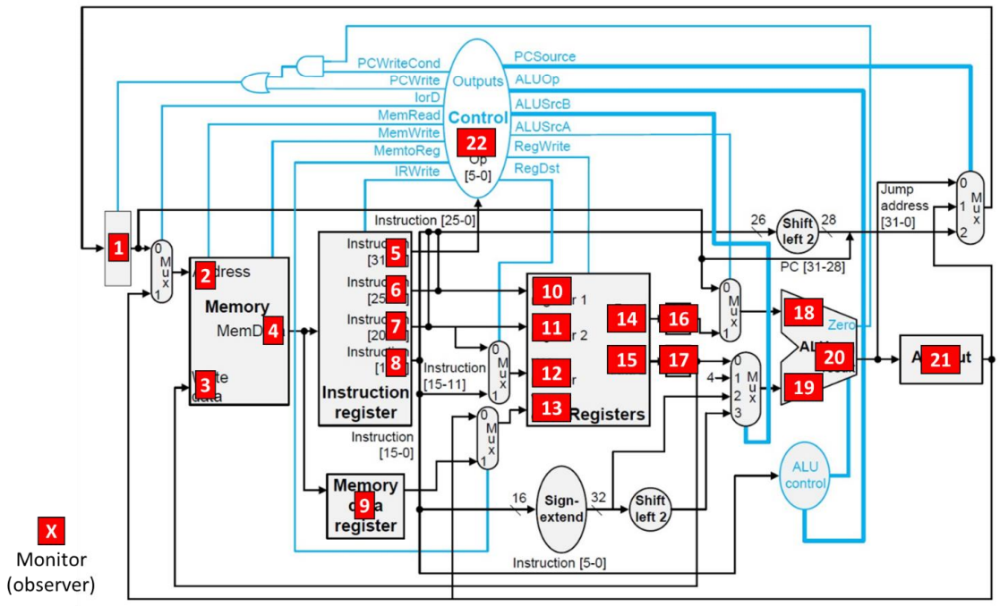

# MIPS32 Multi Cycle Simulator
Cycle-Accurate simulation of a Multi-Cycle MIPS32 Processor in C.

**Processor Diagram:**

## Supported Instructions

**Instruction** | **Functionality**
----------- | -------------
add | Add
addi | Add Immediate
addiu | Add Immediate Unsigned
addu | Add Unsigned
and | And
andi | And Immediate
beq | Branch On Equal
bne | Branch On Not Equal
j | Jump
jal | Jump And Link
jr | Jump Register
lui | Load Upper Immediate
lw | Load Word
nor | Nor
or | Or
ori | Or Immediate
slt | Set Less Than
slti | Set Less Than Immediate
sltiu | Set Less Than Immediate Unsigned
sltu | Set Less Than Unsigned
sll | Shift Left Logical
srl | Shift Right Logical
sw | Store Word
sub | Subtract
subu | Subtract Unsigned

## Input

- Text file including the assembly instructions
- Selected cycles for which extra data will be exported

## Outputs

- For the selected cycles:
  - Register Values
  - Monitors Values (see diagram below)
  - Memory State
- Final Register Values
- Final Memory State
- Total Cycles
- Total Execution Time

**Monitors/Observers:**

